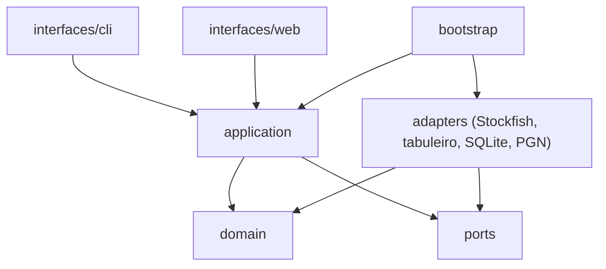

# Arquitetura

## Regra de dependencia

As dependencias apontam para dentro. Nada em `domain/` conhece infraestrutura.

Verificacoes automaticas:

- `ruff` bane o import de `chess` fora de `adapters/` (regra
  `flake8-tidy-imports.banned-api`);
- `domain/` nao importa `pydantic`: a validacao de YAML vive em
  `bootstrap/config.py` e converte para dataclasses puras de
  `domain/rule_set.py`.

## Fronteiras principais

| Fronteira | Contrato | Implementacao atual |
| --- | --- | --- |
| Busca e avaliacao | `ports/engine.ChessEngine` | `adapters/stockfish/client.StockfishEngine` e `tests/fakes/ScriptedEngine` |
| Jogar uma partida | `ports/engine.PlayableEngine` | mesmo adapter, com `UCI_LimitStrength` |
| Regras de tabuleiro | `ports/board.BoardService` | `adapters/board/service.PythonChessBoardService` |
| Persistencia e cache | `ports/analysis_repository.AnalysisRepository` | Entrega 7 (SQLite) |
| Fonte de partidas | `ports/game_source.GameSource` | Entrega 7 (PGN local) |
| Ranking neural futuro | `CandidateRanker` em `adapters/ml/` | Nao existe; so depois de baseline medido |

## Ciclo de vida do motor

O motor **nao** e guardado no `Container`. Cada caso de uso cria, usa e fecha o
motor com ciclo explicito, para que o processo seja encerrado mesmo em caso de
excecao. Estado global de motor ou configuracao e proibido.

No servidor web, `interfaces/web/engine_session.EngineSession` mantem um unico
processo, iniciado sob demanda e encerrado no `lifespan` do FastAPI. Acesso
concorrente e serializado pelo `RLock` interno do `StockfishEngine`, e endpoints
sincronos rodam na threadpool do FastAPI, entao nenhum pedido bloqueia o loop de
eventos.

Forca reduzida (`UCI_LimitStrength`/`UCI_Elo`) e um estado do processo. O adapter
restaura forca total antes de qualquer `analyze`, para que uma partida em nivel
iniciante nao contamine a analise seguinte. Ha teste de integracao para isso.

## Estagios de analise

1. **Discovery** — MultiPV amplo, orcamento moderado, encontra candidatas.
2. **Confirmation** — cada candidata promissora e reanalisada isoladamente com
   `root_moves=[candidata]` e orcamento maior. O rank usado pelos portoes vem
   daqui, nunca do MultiPV de discovery.
3. **Stability** — candidatas proximas de limiar recebem orcamento maior; sem
   esse estagio, `GATE_STABILITY_001` fica indeterminado em vez de aprovado.

Os orcamentos por estagio vem de `Container.budget_for` e sao sempre expressos
em nos, para reprodutibilidade.

## Ponto de vista

Toda avaliacao e normalizada do ponto de vista de quem fez a jogada. Depois de
aplicar a candidata o lado a jogar muda; `NormalizedEvaluation.flipped()` existe
para tornar essa troca explicita e testavel, em vez de deixar o sinal inverter
silenciosamente. Ha testes para brancas e pretas.

## Arquivos e tamanho

Meta de ate 250 linhas por modulo de producao, limite suave de 400. Uma
responsabilidade principal por arquivo. Sem `utils.py`, `helpers.py` ou
`common.py`.
